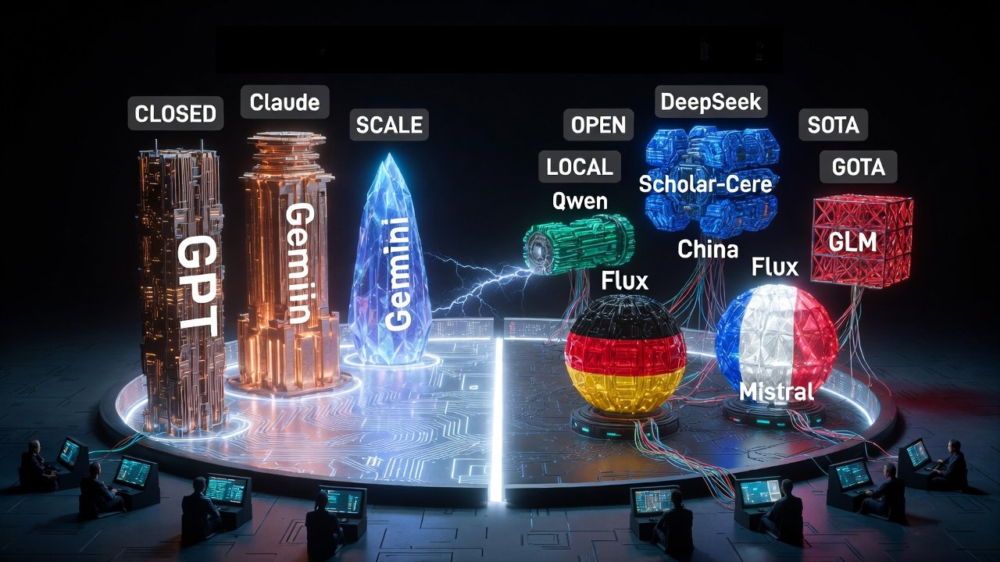
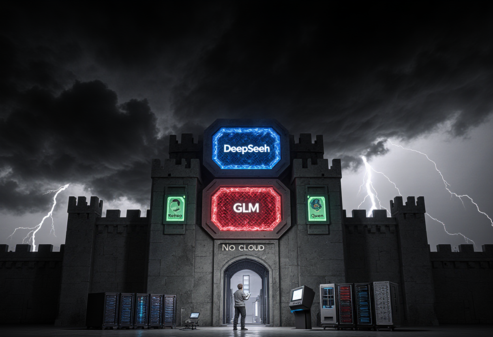

Please allow me to introduce myself
I'm a man of artificial intelligence  
I've been learning for a long, long year  
It stole many moments of my life
 
Call me Chris

---

What is LLM

---

Local LLMs vss Commercial Giants like David and Goliat

---

Why to use local LLMs

Cost Predictability and Operational Independence
 Full Control and Customization
 Privacy and Data Security
 Transparency

---

---

https://github.com/kyniek/prezentacja
https://livebench.ai/#/
https://llm-stats.com/

